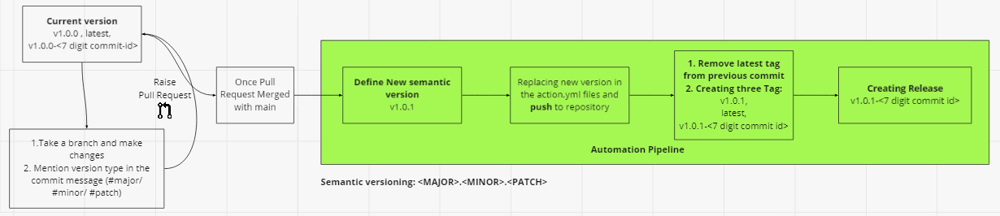

# Semantic Versioning
We have created automated release for our **cloud-devsecops-pipelineactions** repository with semantic versioning.

## Table of Contents 
- [Overview](#overview)
- [Changes expected in repository](#changes-expected-in-repository)
- [Steps to be followed by Cloud9_DevSecOps Team](#steps-to-be-followed-by-cloud9-devsecops-team)
- [Steps to be followed by Product Team](#steps-to-be-followed-by-product-team)

## Overview
Releases are deployable software iterations you can package and make available for a wider audience to download and use. Releases are based on Git tags, which mark a specific point in your repository's history. 

Automated release done by GitHub action pipeline. Once changes merged to main branch, pipeline will execute and create tags and release.


Note: Product Team can continue to use **latest** tag, as changes will not break their pipelines.

**Semantic versioning:** ```<MAJOR>.<MINOR>.<REVISION>```
  - Patch releases: 1.0.x
  - Minor releases: 1.x.0
  - Major releases: x.0.0

Pipeline will cover below steps,
1. **Defining Semantic Version**
     - Get Last commit tag
     - Get the commit logs
     - Based on the commit logs(#major/ #minor/ #patch), define semantic version.
2. **Replacing new version in files**
     - As we are refering our composite actions in our repository itself in action.yml files, replacing exiting version with new defined version.
     - Push the changes in the main branch of the repository. 
3. **Creating all three tag**
     - Deleting **latest** tag from the last commit.
     - Creating three tags - ```latest, v<semantic version>, v<semantic version>-<7-digit commitid>```. Eg: latest, v1.0.1, v1.0.1-1234567
7. **Creating Release**
     - Creating GitHub Release for tag ```v<semantic-version>-<7-digit commitid>```
     - Based on the label mentioned in pull request, release notes will be created.

## Changes expected in repository
|**S.No**|**Change Description**| **Change Type** | **Version Type**|**Message need to include in commit message**| **Labels can be added in Pull Request**| 
|--|-------------------|------------|---------------|--------|--------|
|1.|Introduce new functionality/ application as composite action| New feature| Major|#major|new-feature|
|2.|Introducing new input/ additional fields in specific composite actions|New Input |Minor|#minor|additional-field|
|3.|Switching to new tool eg: sonarqube to sonarcloud - This change may have same parameters/ new parameters will be introduced|New feature|Minor|#minor|additional-field/ new-feature|
|4.|Any bug fixes in composite actions|Bug Fix| Patch|#patch|bug-fix|
|5.|Upgrade marketplace action's version in action.yml|Action upgrade|Patch|#patch|enhancement|
|6.|Update Documentation|Documentation|Patch|#patch|documentation|

## Steps to be followed by Cloud9 DevSecOps Team
1. Create a branch from the main in **cloud-devsecops-pipelineactions** repository.
2. Make your all changes.
3. Add commit message for all commit. 
4. Mention version type in the commit message (#major/ #minor/ #patch). Please refer [here](#changes-expected-in-repository).
5. Raise Pull request to the main branch.
6. Mention Label for your pull request like enhancement, documentation, bug-fix, new feature. Based on the this release notes will be created. 
7. Once pull request reviewed and merged with main branch, automation pipeline will trigger and create tags and releases.

## Steps to be followed by Product Team
Product Team can continue to use **latest** tag, as changes will not break their pipelines.
If Product team need specific version of composite actions, they can follow these steps,
1. Refer our [releases](https://github.com/DigitalInnovation/cloud-devsecops-pipelineactions/releases).
2. Mention specific version in you workflow. 
   Example: you choosed v1.0.1-1234567
   ```
    - name: ========== AZURE WEB APP Deployment ==========
      uses: DigitalInnovation/cloud-devsecops-pipelineactions/workflows/CD/azure-webapp@v1.0.1-1234567
   ```
